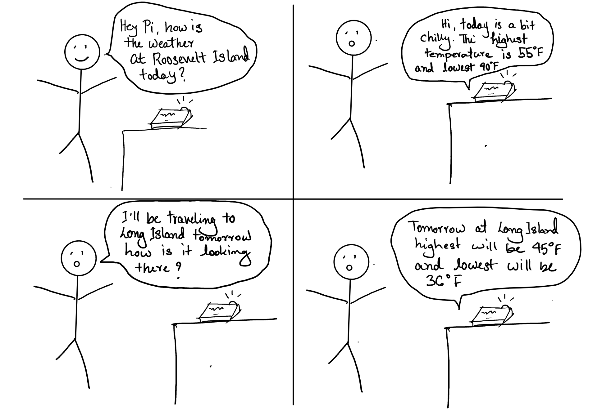

# Chatterboxes
[](https://www.youtube.com/embed/Q8FWzLMobx0?start=19)

In this lab, we want you to design interaction with a speech-enabled device--something that listens and talks to you. This device can do anything *but* control lights (since we already did that in Lab 1).  First, we want you first to storyboard what you imagine the conversational interaction to be like. Then, you will use wizarding techniques to elicit examples of what people might say, ask, or respond.  We then want you to use the examples collected from at least two other people to inform the redesign of the device.

We will focus on **audio** as the main modality for interaction to start; these general techniques can be extended to **video**, **haptics** or other interactive mechanisms in the second part of the Lab.

## Prep for Part 1: Get the Latest Content and Pick up Additional Parts 

### Pick up Additional Parts

As mentioned during the class, we ordered additional mini microphone for Lab 3. Also, a new part that has finally arrived is encoder! Please remember to pick them up from the TA.

### Get the Latest Content

As always, pull updates from the class Interactive-Lab-Hub to both your Pi and your own GitHub repo. As we discussed in the class, there are 2 ways you can do so:

**\[recommended\]**Option 1: On the Pi, `cd` to your `Interactive-Lab-Hub`, pull the updates from upstream (class lab-hub) and push the updates back to your own GitHub repo. You will need the *personal access token* for this.

```
pi@ixe00:~$ cd Interactive-Lab-Hub
pi@ixe00:~/Interactive-Lab-Hub $ git pull upstream Fall2021
pi@ixe00:~/Interactive-Lab-Hub $ git add .
pi@ixe00:~/Interactive-Lab-Hub $ git commit -m "get lab3 updates"
pi@ixe00:~/Interactive-Lab-Hub $ git push
```

Option 2: On your your own GitHub repo, [create pull request](https://github.com/FAR-Lab/Developing-and-Designing-Interactive-Devices/blob/2021Fall/readings/Submitting%20Labs.md) to get updates from the class Interactive-Lab-Hub. After you have latest updates online, go on your Pi, `cd` to your `Interactive-Lab-Hub` and use `git pull` to get updates from your own GitHub repo.

## Part 1.
### Text to Speech 

In this part of lab, we are going to start peeking into the world of audio on your Pi! 

We will be using a USB microphone, and the speaker on your webcamera. (Originally we intended to use the microphone on the web camera, but it does not seem to work on Linux.) In the home directory of your Pi, there is a folder called `text2speech` containing several shell scripts. `cd` to the folder and list out all the files by `ls`:

```
pi@ixe00:~/text2speech $ ls
Download        festival_demo.sh  GoogleTTS_demo.sh  pico2text_demo.sh
espeak_demo.sh  flite_demo.sh     lookdave.wav
```

You can run these shell files by typing `./filename`, for example, typing `./espeak_demo.sh` and see what happens. Take some time to look at each script and see how it works. You can see a script by typing `cat filename`. For instance:

```
pi@ixe00:~/text2speech $ cat festival_demo.sh 
#from: https://elinux.org/RPi_Text_to_Speech_(Speech_Synthesis)#Festival_Text_to_Speech

echo "Just what do you think you're doing, Dave?" | festival --tts
```

Now, you might wonder what exactly is a `.sh` file? Typically, a `.sh` file is a shell script which you can execute in a terminal. The example files we offer here are for you to figure out the ways to play with audio on your Pi!

You can also play audio files directly with `aplay filename`. Try typing `aplay lookdave.wav`.

\*\***Write your own shell file to use your favorite of these TTS engines to have your Pi greet you by name.**\*\*
(This shell file should be saved to your own repo for this lab.)

Bonus: If this topic is very exciting to you, you can try out this new TTS system we recently learned about: https://github.com/rhasspy/larynx

### Speech to Text

Now examine the `speech2text` folder. We are using a speech recognition engine, [Vosk](https://alphacephei.com/vosk/), which is made by researchers at Carnegie Mellon University. Vosk is amazing because it is an offline speech recognition engine; that is, all the processing for the speech recognition is happening onboard the Raspberry Pi. 

In particular, look at `test_words.py` and make sure you understand how the vocab is defined. Then try `./vosk_demo_mic.sh`

One thing you might need to pay attention to is the audio input setting of Pi. Since you are plugging the USB cable of your webcam to your Pi at the same time to act as speaker, the default input might be set to the webcam microphone, which will not be working for recording.

\*\***Write your own shell file that verbally asks for a numerical based input (such as a phone number, zipcode, number of pets, etc) and records the answer the respondent provides.**\*\*

Bonus Activity:

If you are really excited about Speech to Text, you can try out [Mozilla DeepSpeech](https://github.com/mozilla/DeepSpeech) and [voice2json](http://voice2json.org/install.html)
There is an included [dspeech](./dspeech) demo  on the Pi. If you're interested in trying it out, we suggest you create a seperarate virutal environment for it . Create a new Python virtual environment by typing the following commands.

```
pi@ixe00:~ $ virtualenv dspeechexercise
pi@ixe00:~ $ source dspeechexercise/bin/activate
(dspeechexercise) pi@ixe00:~ $ 
```

### Serving Pages

In Lab 1, we served a webpage with flask. In this lab, you may find it useful to serve a webpage for the controller on a remote device. Here is a simple example of a webserver.

```
pi@ixe00:~/Interactive-Lab-Hub/Lab 3 $ python server.py
 * Serving Flask app "server" (lazy loading)
 * Environment: production
   WARNING: This is a development server. Do not use it in a production deployment.
   Use a production WSGI server instead.
 * Debug mode: on
 * Running on http://0.0.0.0:5000/ (Press CTRL+C to quit)
 * Restarting with stat
 * Debugger is active!
 * Debugger PIN: 162-573-883
```
From a remote browser on the same network, check to make sure your webserver is working by going to `http://<YourPiIPAddress>:5000`. You should be able to see "Hello World" on the webpage.

### Storyboard

Storyboard and/or use a Verplank diagram to design a speech-enabled device. (Stuck? Make a device that talks for dogs. If that is too stupid, find an application that is better than that.) 

\*\***Post your storyboard and diagram here.**\*\*



Write out what you imagine the dialogue to be. Use cards, post-its, or whatever method helps you develop alternatives or group responses. 

\*\***Please describe and document your process.**\*\*

This device is designed to give weather specifically temperature information to the user depending on the location input. So, for the dialogue I asked the user to ask about temperature information regarding a location and time. As the device, I wrote down the script I would use to respond to user's input prompts. For example, the standard reply to user would be "Where are you going?", "Today's temperature at X location is Y degree highest and lowest is Z degree."

### Acting out the dialogue

Find a partner, and *without sharing the script with your partner* try out the dialogue you've designed, where you (as the device designer) act as the device you are designing.  Please record this interaction (for example, using Zoom's record feature).

[Watch Here](https://youtu.be/2Ng8S3fJtBI)

\*\***Describe if the dialogue seemed different than what you imagined when it was acted out, and how.**\*\*

The dialogue was roughly similar to what I expected it to be. However, I realized users may ask questions differently and the device must be able to distinguish what was being asked despite the differences. Also, it is tougher to act out exactly how a device would response as a person since there are emotions being displayed from the person who is pretending to be a computer.

### Wizarding with the Pi (optional)
In the [demo directory](./demo), you will find an example Wizard of Oz project. In that project, you can see how audio and sensor data is streamed from the Pi to a wizard controller that runs in the browser.  You may use this demo code as a template. By running the `app.py` script, you can see how audio and sensor data (Adafruit MPU-6050 6-DoF Accel and Gyro Sensor) is streamed from the Pi to a wizard controller that runs in the browser `http://<YouPiIPAddress>:5000`. You can control what the system says from the controller as well!

\*\***Describe if the dialogue seemed different than what you imagined, or when acted out, when it was wizarded, and how.**\*\*

# Lab 3 Part 2

For Part 2, you will redesign the interaction with the speech-enabled device using the data collected, as well as feedback from part 1.

## Prep for Part 2

1. What are concrete things that could use improvement in the design of your device? For example: wording, timing, anticipation of misunderstandings...

Asking small questions would avoid complexity of the system. The longer an input answer the harder it would be for the system to distinguish what is being asked. Also focusing on keywords could take down a lot of complexity as well. This way if an user talks a lot, the keywords would guide the system to the right topic of discussion. 

2. What are other modes of interaction _beyond speech_ that you might also use to clarify how to interact?

Adding a feature that identifies physical presence could improve on interactions. For instance, if an user comes within a certain range, the device could activate and ask the user a question on how the device could help.

3. Make a new storyboard, diagram and/or script based on these reflections.

**Peer Review**
<br>
<br>
Magdalena Yin Horowitz - "I really love this idea! It makes it so much easier to check the weather while you're getting dressed, making coffee, etc. The speech interaction is a great way to make up and is super interactive.
Maybe you can integrate it with your calendar so it knows you are traveling to Long Island in the next couple of days.."
<br>
<br>
Laurin Alexis Tran - "Definitely a useful device! I personally use an Amazon Alexa to do the same thing when I'm lying in bed trying to figure out what to wear while being too lazy to pick up my phone to look up the weather. Maybe an iteration could be suggestions on how warmly to dress? I think your storyboard and video are very straightforward and clear. However, one thing that is a bit unclear is why the pi says "today is a bit chilly" before saying the temperatures for the first question and not the second, although this is a very minute detail. I also think it is interesting how you have the user and Pi use conversational phrases such as greeting each other and saying thank you."
<br>
<br>
**Potential Ways to Improve**
<br>
I like Magdalena's input that adding a calendar component could keep in track of the travel days and what type of weather we should expect coming up. Combining that with Laurin's idea that Pi giving input on what type of clothing we should wear to prevent any unwanted surprises like stormy, cold or hot weather. Additionally I am looking forward to implement more conversational phrases such as greeting each other and saying thank you, to make the interaction with the device as humanely as possible.

## Prototype your system

The system should:
* use the Raspberry Pi 
* use one or more sensors
* require participants to speak to it. 

*Document how the system works*

Drawing inspiration from our daily interactions with weather I wanted to create a device that would directly inform users with weather news. Although many weather news and apps exists, we are constantly in a rush and sometimes we don't get to look over the weather. To solve that problem I designed a device which is quick and simple to use. 

Material's and software tools used:
<br>
- Python's [SpeechRecognizer](https://pypi.org/project/SpeechRecognition/)
- RaspberryPi
- USB mini microphone
- Soft cardboard
- APDS-9960 (IR Sensor)
- Adafruit Mini PiTFT
- HD Webcam and Speaker

<br>
Users would simply touch the device where the IR sensor would signal the system to ask the user "What's up?" or "How can I help?" from the speaker. Once the device greets, it listens for user's input from the USB microphone. The input voice then gets recorded and read by python's [SpeechRecognizer](https://pypi.org/project/SpeechRecognition/) package. For this prototype, I allowed the users to ask about current, and future weather forecasts at a specific location. The data is fetched from [wttr.in](http://wttr.in) using cURL function, once the users ask about the weather at a specific location. Also, the system can forecast up to 2 days in the future. This part is fully automated and can be easily implemented with more locations than what was listed. Additionally, the user could ask what's on their calendar and the system would be able to look at future events and give the user a heads up on what weather to expect and what should the user wear and bring with them. 

*Include videos or screencaptures of both the system and the controller.*

Interaction Demo:
<br>[Watch here](https://youtu.be/tI52LaNvtJg)

## Test the system
Try to get at least two people to interact with your system. (Ideally, you would inform them that there is a wizard _after_ the interaction, but we recognize that can be hard.)

Answer the following:

### What worked well about the system and what didn't?
<br>
The system worked well for speech recognition. Python's speech recognition package was able to distinguish users' speech and convert them into text which was used as an input to the system. Additionally, the system would parse on keywords such as 'weather', 'calendar', 'today', 'tomorrow', 'New York' and other locations pretty well which helped to create a streamline process. Additionally, collecting weather information from online was pretty efficient as well. Displaying the information on Mini PiTFT was a bonus touch for users to visually interact with the information. Although the system is working as intended it also has limited capacity in terms of delivering information to the users. For example, users had limited amount of control when it came to modifying the events.

### What worked well about the controller and what didn't?
<br>
The controller had a simple functionality for this system. The cardboard to hide the sensors added a nice touch, also the sensor was able to pick up signals based on simple touch. Also with the cardboard being soft the users didn't have to press too hard to initialize the system. However since the sensor wasn't placed at a fixed location, users had to touch on different area to activate the system. The touch here region helped to locate the sensor a bit.

### What lessons can you take away from the WoZ interactions for designing a more autonomous version of the system?
<br>
People tend to talk more naturally and has a lot of redudant information in their speech usually. There could be ways you identify the keywords the user is talking about by implementing more of an NLP approach. Also instead of using touch sensing to activate the system, there could be a visual sensing tool to initiate the interaction. For instance, using computer vision tool, the system could recognize there is an user in front of it. This way it would be more natural because the users won't have to physically do anything to work with the device.


### How could you use your system to create a dataset of interaction? What other sensing modalities would make sense to capture?
<br>
I would use my system to create a dataset of interaction by collecting the time of the questions as well as the locations being covered. Additionally the frequency of question would also be a great indicator of how active a person is since you have to go out prepared. I think adding a temperature sensor would be a great addition as well. This way the system would be able to understand user's room temperature and compare it with outside temperature to give a better feeedback in terms of what to expect if they were to go outside. 

